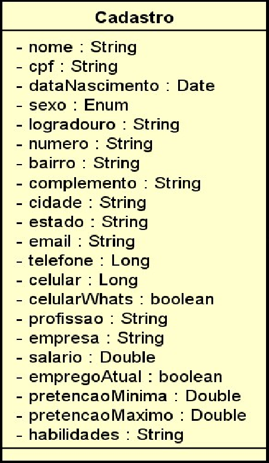

# People Job - Sistema de aplicação de vagas  

`Atividade para conclusão dia 18/06/23`  

## A proposta  

O escopo inicial do projeto contempla a elaboração de um programa simples onde é possível que o candidato preencha via console seus dados pessoais, endereço, contato e experiência profissional mencionando uma faixa salarial pretendida. Este registro deverá ser coletado pelo sistema e gerar dois arquivos com os layouts *delimitado* e *posicional* respectivamente considerando as informações abaixo.  

- Dados Pessoais: Nome, CPF, Data Nascimento, Sexo
- Dados Endereço: Logradouro, Número, Complemento, Bairro, Cidade, Estado
- Dados Contato: E-mail, Telefone, Celular, Se celular for WhatsApp
- Dados Profissionais: Profissão, Empresa, Salário, Emprego Atual
- Habilidades: Uma lista de habilidades
- Pretenção Salarial: Valor Mínimo, Valor Máximo
